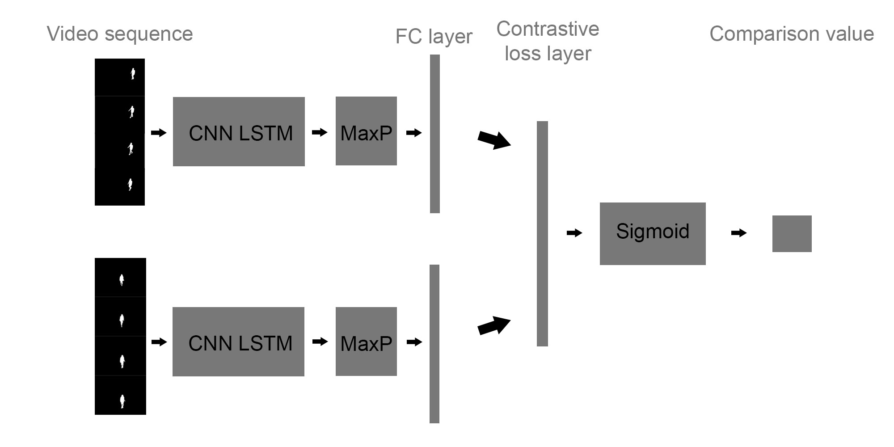
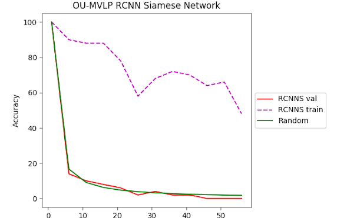
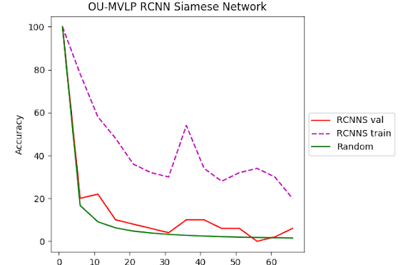

# RCNNSiame

## Abstract

The field of gate recognition has been evolving rapidly thanks to the advent of deep learning in the early 2010s. however such systems still depend heavily on a lot of data from the same individual, walking in a different direction and with different clothes/items. Making such systems impractical for real-world engineering applications, in fact, such applications still rely on handcrafted features to describe and recorded individuals by an ID. Recent advancements have shown that siamese networks can successfully create representations of individuals given a small video sample, which can later be compared to create a similarity index. This project attempts to improve the video to siamese representation pipeline by introducing the RCNNsiame network (Recurrent convolutional siamese neural network).

## Results

Fig2, Fig3: RCNNSaime was trained at 0°,30° and tested at 15°,45° degrees hence showing the performance of ±15°. Left a network with 7 million parameters. Right a network with 120 million parameters.

Solarized dark             |  Solarized Ocean
:-------------------------:|:-------------------------:
  

## Conclusion

This multi-view test wasn’t as much as a success as initially thought, however, there have been some good signs that some sort of performance can be achieved with some changes to the model. Therefore, the biggest achievement from this project is not so much the results, but the introduction of a framework to test recurrent convolutional models with video from the OU-ISIR Gait Database. The user can change the script with his own model designs and use the SortOUISIR.py script to generate appropriate invariance tests.

## Tutorial

SortOUISIR.py is used to generated the test dataset. First email gaitdb_admin@am.sanken.osaka-u.ac.jp the signed relise agreement form OUMVLP_ReleaseAgreement.pdf. After a few days they will email you a password that can be used to unzip the datafolders that can be downloaded from http://www.am.sanken.osaka-u.ac.jp/BiometricDB/GaitMVLP.html. Create a home folder. Place the data in a folder named 'Data', this data folder should contain all angle folders. In the home folder create a folder named 'Code' and place the SortOUISIR.py script inside, also in the home folder create a project folder named, for example, 'Gate_sis'. In this folder place a 'Code', 'data', 'weights' folder. Place the RCNNSiame.py script in the 'Code' folder.

The environment should look like this:

HOME
* Code
    * SortOUISIR.py
* Data
    * all angles
* 'Project name'
    * Code
        * RCNNSiame.py
        * other models that youd like to test
    * data
    * weights

'Edit the SortOUISIR.py script to include your project name where 'Gate_sis' is present'

The script can be opened and run using python 3.5

While the RCNNSiame.py script needs keras and a tensorflow-gpu environment to run. Idealy use an ananconda virtual environment.
